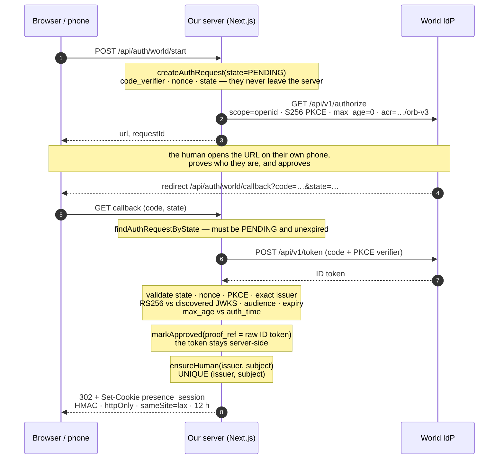
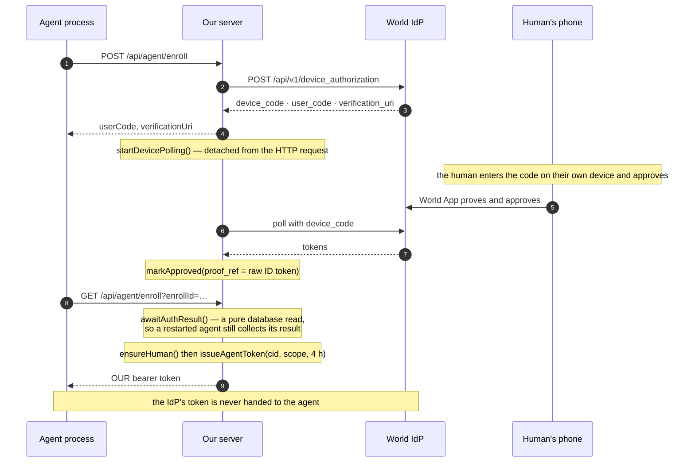
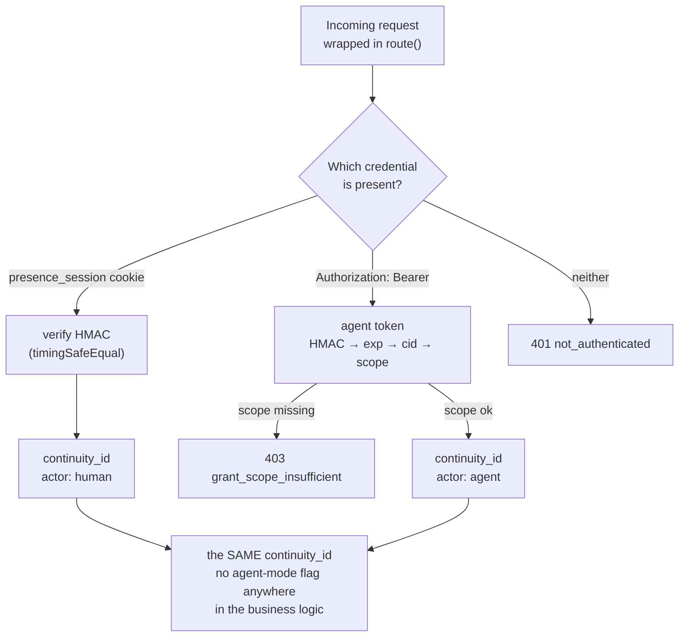
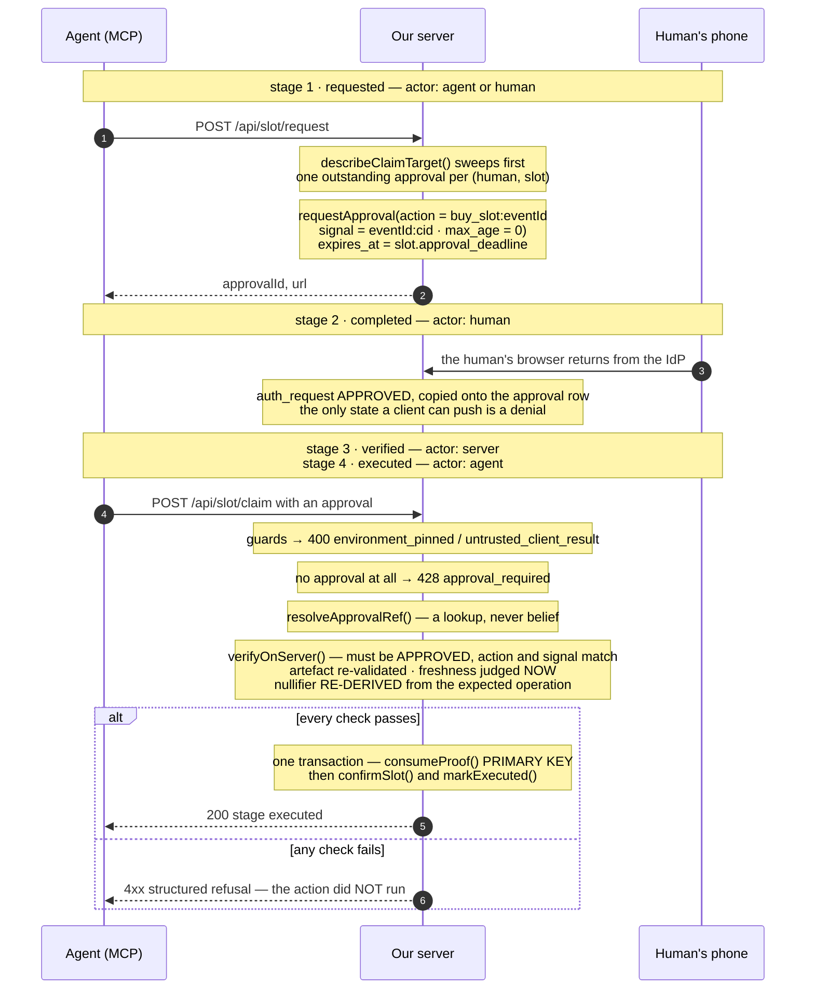
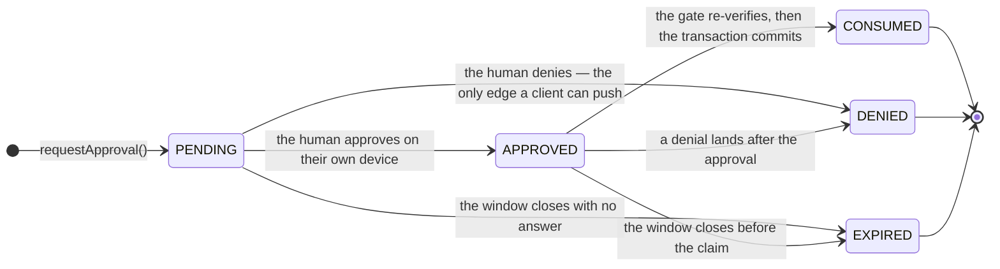

# AUTH_FLOW.md — authentication and authorization, end to end

> Two different questions, deliberately kept apart:
>
> * **Authentication** answers *who is this* — World ID → a `continuity_id` → a session
>   cookie or an agent token.
> * **Authorization** answers *may this exact operation happen, right now* — an approval
>   bound to one `(action, signal)`, re-verified at execution time, consumed exactly once.
>
> **A valid session never authorizes anything.** It establishes who is asking; the gate
> re-checks everything else from server state, per operation. That separation is the design.

### Viewing the diagrams

The four flows below are written in [Mermaid](https://mermaid.js.org), which renders inline
on GitHub, GitLab, VS Code's markdown preview, Obsidian and Notion — nothing to install.
Rendered PNGs are in [`diagrams/`](diagrams/), and the `.mmd` sources there can be
re-rendered anywhere, including at <https://mermaid.live>. Each diagram also keeps a
plain-text version in a collapsed block, so the document still reads in a terminal.

---

## 0. The parties, and what each one holds

| Party | Runs where | Holds | Cannot |
|---|---|---|---|
| **Human's phone** | World App, the human's own device | Their World ID credential | Be impersonated by the server, the browser JS, or the agent |
| **Browser** | The human's laptop | Only what it is given: a redirect URL, a session cookie after sign-in, an opaque `approvalId` | See a token, a secret, or a verdict; assert an outcome |
| **Our server** | Next.js route handlers, one process | Client secret, signing key, the raw ID token, the nullifier, the database | Decide who a human is without the IdP |
| **Agent** | A separate process (MCP stdio server, or `agent/runner.ts`) | A scoped bearer token **we** minted | Create an approval, widen its own scope, act for anyone but its human |
| **World IdP** | `sandbox.auth.world.org` | The human's identity | Authorize anything in *our* domain — it issues identity, not authorization |

Everything below is one of three credentials and one gate.

---

## 1. Authentication

### 1a. Human in a browser — authorization code + S256 PKCE



<details>
<summary>Plain-text version</summary>

```
 browser / phone              our server (Next.js)                    World IdP
 ───────────────              ────────────────────                    ─────────
 POST /api/auth/world/start ─►
                              worldid.startFreshAuth()               app/api/auth/world/start/route.ts
                                createAuthRequest(state=PENDING)     worldid/requests.ts
                                  + code_verifier, nonce, state      ← secrets never leave the server
                                beginAuthorization(max_age=0)        worldid/oidc.ts
      ◄── { url, requestId } ─┘        │
                                       └────────► GET /api/v1/authorize
 human opens the URL on                              scope=openid · S256 PKCE
 their own phone, proves                             max_age=0 · acr=…/orb-v3
 and approves                                        state · nonce
      │                                                       │
      └──────────────── redirect ──────────────────────────────┘
              /api/auth/world/callback?code=…&state=…
                                       │
                              completeOidcCallback()                 worldid/index.ts
                                findAuthRequestByState(state)  → must be PENDING + unexpired
                                redeemAuthorizationCode()             worldid/oidc.ts
                                  openid-client validates ALL of:
                                    state · nonce · PKCE code_verifier
                                    exact issuer · RS256 vs discovered JWKS
                                    audience · expiry · max_age vs auth_time
                                markApproved(proof_ref = the raw ID token)
                                       │                             ← stored server-side only
                              handleCallback()                       lib/callback.ts
                                awaitAuthResult()   → pure DB read
                                ensureHuman(issuer, subject)         UNIQUE (issuer, subject)
                                issueSession(continuity_id)          lib/session.ts
      ◄── 302 + Set-Cookie: presence_session ─┘
          HMAC-SHA256 · httpOnly · sameSite=lax · 12 h · carries only a cid
```

</details>

Three things worth noticing:

1. **The browser carries a `code`, never a verdict.** There is no code path where a client
   states that verification succeeded.
2. **The link proof is deliberately not consumed.** Its job is to answer "is this a
   verified, unique human", which is exactly what a persistent identity is for. Consumption
   is reserved for operations that must happen once. (`link_identity:humangate` →
   `linkAction()` in `lib/gate.ts`.)
3. **The callback is intent-agnostic.** It completes whichever attempt its `state` names —
   a link attempt or a purchase approval — and signs the browser in as that human. So a
   human who approves a purchase on their laptop ends up with a session, which is a
   harmless side effect and not a second authorization path.

### 1b. Headless agent — RFC 8628 device grant, then a credential **we** mint



<details>
<summary>Plain-text version</summary>

```
 agent process                      our server                          World IdP
 POST /api/agent/enroll ──────────►
                                    startFreshAuth(action='enroll_agent:humangate')   app/api/agent/enroll/route.ts
                                      createAuthRequest(PENDING)
                                      device.initiate() ─────────► POST /api/v1/device_authorization
      ◄── { userCode, verificationUri } ┘ ◄── device_code, user_code ┘
                                      device.startDevicePolling()   ← DETACHED from the request
                                                                      worldid/device.ts
 human enters the code on their phone and approves
 GET /api/agent/enroll?enrollId= ─►
                                    awaitAuthResult()  ← pure database read, restart-safe
                                    ensureHuman(issuer, subject)
                                    issueAgentToken({ cid, scope, 4 h })    lib/agenttoken.ts
      ◄── OUR bearer token ─────────┘      the IdP's token is never handed to the agent
```

</details>

Why the RP mints its own credential: the IdP's access token is an OIDC response artifact
and by the IdP's own documentation "does not authorize calls to this MCP or downstream
services". The correct shape — quoted from the World `oidc` guide — is *"An ID token after
fresh World proof and explicit approval; **your backend issues the agent's credential**."*
So we issue an HMAC-signed, scoped, expiring token carrying a `cid` and
`['agent:queue','agent:claim']`. It says **who the agent acts for**, never **what is
authorized**.

The device grant has no `max_age`/`prompt`/`acr_values` controls — and needs none: the
human proves and approves on their own device on every attempt, so freshness is structural
rather than requested.

### 1c. The disclosed fallback

With no portal-issued client credentials, `idpMode()` returns `local` and
`worldid/local.ts` substitutes **the identity provider, never the gate**: a server-signed
assertion bound to `(action, signal)`, re-validated on every use, with the same nullifier
derivation, the same freshness rule and the same one-time consumption. Every response
carries `degraded: true` and the UI says so. It proves no humanness, and it says so out
loud.

---

## 2. Caller resolution — one function, two kinds of credential

Every route is wrapped in `route()` (`lib/api.ts`), which turns thrown refusals into
structured JSON and establishes the request's event context. `requireCaller()` then answers
"who":



<details>
<summary>Plain-text version</summary>

```
                     ┌─ presence_session cookie ─► verify HMAC (timingSafeEqual) ─► cid
 Authorization: … ───┤                                                              actor: 'human'
 Bearer <token>      └─ agent token ─► HMAC ─► exp ─► cid ─► scope check ──────────► actor: 'agent'
                                                                  │
 neither ─────────────────────────────────────────────────────────┴──► 401 not_authenticated
 wrong scope ──────────────────────────────────────────────────────────► 403 grant_scope_insufficient
```

</details>

Both paths end at **the same `continuity_id`**, and there is no "agent mode" flag anywhere
in the business logic — so an agent can never be treated as a privileged caller. The only
thing `via` is used for is attribution: `actor: 'agent' | 'human'` is written to
`audit_event.actor` and `approval.requested_via`, which is what makes "an agent bought
this, on a human's behalf" a readable fact rather than an assertion.

| | Session cookie | Agent bearer token |
|---|---|---|
| Issued by | `issueSession()` after a verified link | `issueAgentToken()` after a device-grant enrollment |
| Lifetime | 12 h | 4 h |
| Carries | `cid`, `iat`, `exp` | `cid`, `scope[]`, `iat`, `exp`, `kid`, label |
| Signature | HMAC-SHA256, key server-only | same |
| Provenance recorded | `actor: 'human'` | `actor: 'agent'` |

---

## 3. Authorization — the gate

Four stages, each attributed to whoever actually performed it.

| # | Stage | Actor | What advances it | Code |
|---|---|---|---|---|
| 1 | `requested` | agent or human | An approval row is opened for one `(action, signal)` | `requestClaimApproval()` · `lib/gate.ts` |
| 2 | `completed` | **human** | The human finishes on their own device; the IdP confirms it | `syncApproval()` · `lib/approval.ts` |
| 3 | `verified` | **server** | The server re-verifies the proof for this operation | `verifyOnServer()` · `worldid/index.ts` |
| 4 | `executed` | agent | The protected action commits, in the same transaction as the consumption | `executeClaim()` · `lib/gate.ts` |

Stage 2 is the only one an agent cannot perform for itself. Stage 3 is the one that makes
the other three mean anything.



<details>
<summary>Plain-text version</summary>

```
 stage 1   POST /api/slot/request
             requireCaller()                      → 401 / 403
             guardClientSuppliedEnvironment()     → 400 environment_pinned
             requestClaimApproval()
               describeClaimTarget()   sweep → allocated? already held? deferred? drawn?
               one outstanding approval per (human, slot) — a repeat is a 409, not a stack
               requestApproval(action = 'buy_slot:<eventId>',
                               signal = '<eventId>:<cid>',
                               max_age = 0)
               approval.expires_at = slot.approval_deadline   ← one clock, not two
           ◄── { approvalId, url | deviceCode, windowSec }

 stage 2   the human opens the URL on their own device and approves
             IdP → callback → completeOidcCallback() → auth_request = APPROVED
             GET /api/approval/{id} (polling) → syncApproval() copies it onto the
             approval row and writes stage 2 as actor: 'human'
             A denial is the ONLY state a client can push (POST /api/approval/{id}),
             and it can only remove authorization, never grant it.

 stage 3+4 POST /api/slot/claim  { approval }
             guardClientSuppliedEnvironment()     → 400 environment_pinned
             guardForgedClientResult()            → 400 untrusted_client_result
             requireCaller()                      → 401 / 403
             executeClaim(approvalRef)                               lib/gate.ts
               no approval presented              → 428 approval_required
               describeClaimTarget()              → 400/410 no_slot_allocated | deferred…
               resolveApprovalRef()               LOOKUP, never belief → 404 approval_not_found
               identity / slot binding            → 403
               verifyApproval() ─► worldid.verifyOnServer()
                     request must be APPROVED
                     action & signal must match the expectation
                     artefact re-validated (issuer · audience · exp · auth_time)
                     freshness judged NOW against auth_time
                       (max_age=0 ⇒ auth_time must not predate this attempt)
                     nullifier RE-DERIVED from the EXPECTED operation,
                       never read from the stored row
               ┌─ tx ──────────────────────────────────────────────────────┐
               │ consumeProof()  INSERT … nullifier PRIMARY KEY            │ → 409 proof_replay_detected
               │ confirmSlot()                                             │ → 409 already_owns_entitlement
               │ markExecuted()   stage 4                                  │
               └───────────────────────────────────────────────────────────┘
           ◄── 200 { stage: 'executed', nullifier, stages: {…} }
```

</details>

### Why the nullifier is re-derived rather than read

```ts
nullifier = sha256("humangate/v1/nullifier" | issuer | subject | action | signal)
```

The OIDC IdP returns no action-scoped nullifier, so the relying party reconstructs the
IDKit guarantee `human × rp_id × action` itself. Two consequences that matter here:

* it is **deterministic**, so a second attempt at the same operation produces the same key
  and the `PRIMARY KEY` rejects it;
* it is derived from the **expected** operation at verification time, so a caller cannot
  change the action and still present the key it was given.

`UNIQUE (bound_action, continuity_id)` is the second, belt-and-braces constraint: it keeps
"one person, one entitlement per action" true even if the derivation ever changed.

### 3b. The approval's lifecycle

An approval is a row with a lifetime, not a boolean. These are the transitions the code
actually performs — including one it does *not*: a verification failure at the gate writes
an audit row (`approval.rejected_at_gate`) and **leaves the state alone**, so a refusal
never launders an approval into a spent one.



<details>
<summary>Plain-text version</summary>

```
[*] --> PENDING              requestApproval()
PENDING  --> APPROVED        the human approves on their own device
APPROVED --> CONSUMED        the gate re-verifies, then the transaction commits
PENDING  --> DENIED          the human denies — the only edge a client can push
PENDING  --> EXPIRED         the window closes with no answer
APPROVED --> EXPIRED         the window closes before the claim
APPROVED --> DENIED          a denial lands after the approval
CONSUMED / DENIED / EXPIRED  terminal
```

</details>

The asymmetry is the design: **a client can move exactly one edge, and moving it can only
remove authorization.** There is no client-reachable path into `APPROVED` or `CONSUMED` —
both are written by the server, the first after its own exchange with the IdP and the second
inside the gate's transaction.

---

## 4. Every credential, and what it proves

| Credential | Held by | Stored | Lifetime | Proves | Does **not** prove |
|---|---|---|---|---|---|
| World ID ID token | our server only | `auth_request.proof_ref` | one attempt | who, and that they authenticated *now* | that anything is authorized |
| Session cookie | the browser | client, signed | 12 h | who is asking | freshness, or any permission |
| Agent bearer token | the agent process | client, signed | 4 h | who the agent acts **for** | what is authorized |
| Approval reference (`apv_…`) | whoever asked; safe for the model to hold | `approval` row | the slot's window | nothing on its own — it is a **lookup key** | anything, until the server re-verifies |
| Nullifier | never handed out as authority | `consumed_proof.nullifier` | forever (or the action's life) | this `(human, action, signal)` has been spent | who the human is |
| `continuity_id` | server-side only | `human` row | — | stable pseudonymous identity across sessions and agents | humanness by itself (it is derived from a verified subject) |

---

## 5. What is refused, and by which layer

| Layer | Refusal | Code |
|---|---|---|
| Caller resolution | no cookie, no token | `not_authenticated` (401) |
| Caller resolution | agent token without the needed scope | `grant_scope_insufficient` (403) |
| Request guards | body names an `environment` | `environment_pinned` (400) |
| Request guards | body carries a verdict (`{ok:true}`, `clientResult`, `proof`) | `untrusted_client_result` (400) |
| Gate | no approval presented at all | `approval_required` (428) |
| Gate | approval not in server state | `approval_not_found` (404) |
| Gate | approval belongs to another human / another slot | `approval_identity_mismatch`, `approval_signal_mismatch` (403) |
| Verification | action or signal mismatch | `approval_action_mismatch`, `approval_signal_mismatch` (403) |
| Verification | authentication too old, or predates the request | `not_fresh` (400) |
| Verification | human denied / window closed | `approval_denied` (400), `approval_expired` (410) |
| Consumption | the proof was already spent | `proof_replay_detected` (409) |
| Consumption | this human already holds this action | `already_owns_entitlement` (409) |

Every row is executed by `npm run e2e` and `npm test`, and each ends with a database
read-back proving the protected action did not run — see
[`FAILURE_MATRIX.md`](FAILURE_MATRIX.md).

---

## 6. Hardening notes (honest)

Not vulnerabilities anyone could reach in the demo, recorded because they are real:

* **`GET /api/approval/{id}` authenticates the caller but does not check ownership** — it
  returns `isMine` instead of refusing. Approval ids are 72 bits of randomness
  (`newId()` → `crypto.randomBytes(9)`), so enumeration is not feasible, but an ownership
  check would make the question moot.
* **The raw ID token is stored in `auth_request.proof_ref`** for every attempt, at ~1–2 KB
  per row, and nothing prunes terminal rows. That table — not `consumed_proof` — is the one
  that grows with traffic. A retention policy is the obvious next step.
* **Revocation is local.** Nothing on the OIDC surface can be revoked (there is no
  revocation endpoint and no refresh token); our own session and agent tokens carry a TTL
  and are validated per request, and because nothing is cached, a revoked grant or a
  deleted session takes effect on the next request.
